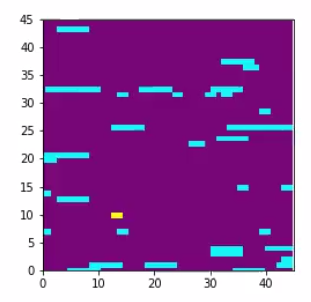
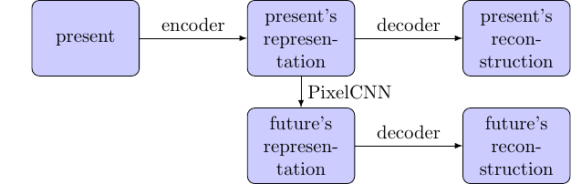

# About Me

- 2\textsuperscript{nd} year undergraduate
- Mathematics and Computer Science major
- Biology minor

<br />

- PhD in machine learning
- Machine learning for medicine

# Problem

- Autonomous agent ("person")
- Move to goal ("dog")
- Person lost their dog in a field of crocodiles
- Person cannot touch the crocodiles, but the dog can
- Predict other objects' positions

# Game

[](https://www.youtube.com/watch?v=iXCcxU-Vpvc&feature=youtu.be)

# Planning Agent

- We can use a model-free agent or a planning agent
- Model-free agent: does not explicitly predict the future (faster)
- Planning agent: explicitly predicts the future (more reliable)

# Overall model

```
for each frame:
	consider the past few frames
	predict many frames in advance
	decide where to move
```

# Future Predictor



# VQ-VAE

- VAE: continuous embeddings
- VQ-VAE: discrete embeddings

# PixelCNN

- RNN: effective but slow
- CNN: fast but less accurate
